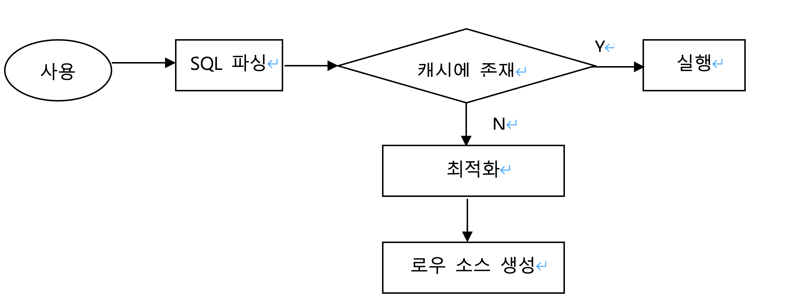

## 1. SQL 파싱과 최적화

### 1.1 SQL : Structed Query Language
- SQL is designed for a specific purpose: to query data contained in a relational database,
- SQL is a set-based, declarative query laguage, not an imperative language such as C or Basic
  - SQL은 원하는 결과집합을 구조적, 집합적으로 선언하지만, 그 결과를 만드는 과정에서 절차적인 프로시저를 만들어서 사용하고, 그런 프로시저를 만들어 내는 DBMS 내부 엔진이 SQL 옵티마이저이다.

### 2 SQL 최적화
- SQL 파싱 -> SQL 최적화 -> 로우 소스 생성
1. SQL 파싱
   - 파싱트리 생성 : SQL문을 이루는 개별 구성요소를 분석 후 파싱 트리 생성
   - Syntax 체크 : 키워드 체크
   - Semantic 체크 : 테이블 또는 컬럼, 오브젝트에 대한 권한 체크
2. SQL 최적화
   - 옵티마이저(Optimizer)가 미리 수집한 시스템 및 오브젝트 통계 정보를 바탕으로 다양한 실행경로를 생성, 비교 후 가장 효율적인 실행경로를 선택
3. 로우 소스 생성
   - 로우 소스 생성기(Row-Source Generator)가 옵티마이저가 선택한 실행경로를 실제 실행 가능한 코드 또는 프로시저 형태로 포맷

### 1.3 SQL 옵티마이저
- 사용자가 원하는 작업을 가장 효율적으로 수행할 수 있는 최적의 데이터 엑세스 경로를 선택해주는 DBMS의 핵심 엔진
  - 옵티마이저의 최적화 단계 [그림 1-3]: p20 참조
    1. 쿼리 수행 후 실행계획 검색
    2. 데이터 딕셔너리(Data Dictionary)에 미리 수집해  둔 오브젝트 통계 및 시스템 통계 정보를 이용해 각 실행계획의 예상비용 산정
    3. 최저비용 실행계획 선택

### 1.4 실행계획과 비용
- 실행계획
  - SQL 옵티마이저가 생성한 처리 절차를 사용자가 확인할 수 있게 트리 구조로 표현한 것
- 비용(Cost)
  - 쿼리를 수행하는 동안 발생할 것으로 예상하는 I/O 횟수 또는 예상 소요 시간을 표현한 값 

### 1.5 옵티마이저 힌트
- 옵티마이저 힌트: Optimizer customizing
- 옵티마이저 힌트를 사용하여 사용자가 직접 효율적인 액서스 경로를 지정.

1. 사용법
   - 주석 기호(/**/)에 ‘+’를 붙임
```
 EX) SELECT /*+ INDEX(A 고객_PK) */
		고객명, 연락처, 주소, 가입일시
FROM 고객 A
WHERE 고객ID = ‘000000008’
```

2. 주의사항
   - 힌트 안에 인자를 나열할 땐 ‘,’(콤마)를 사용할 수 있지만, 힌트와 힌트 사이에 사용할 수 없음(/*+ INDEX(A A_X01) INDEX(B, B_X03) */)
   - 테이블을 지정할 때 스키마명까지 명시하면 안 됨
   - FROM 절 테이블 명 옆에 ALIAS를 지정했다면, 힌트에도 반드시 ALIAS를 사용.
3. 자주 사용하는 힌트 목록: [표 1-1]: p27~28 참조

## 2. SQL 공유 및 재사용
- 소프트 파싱과 하드 파싱의 차이점

1. 소프트 파싱 VS 하드 파싱
   - 라이블리 캐시(Library Cache): SQL파싱, 최적화, 로우 소스 생성 과정을 거쳐 생성한 내부 프로시저를 반복 재사용할 수 있도록 캐싱해 두는 메모리 공간.
   - SGA(System Global Area): 서버 프로세스와 백그라운드 프로세스가 공통으로 엑서스하는 데이터와 제어 구조를 캐싱하는 메모리 공간([그림 1-4]: p29).
   - 소프트 파싱(Soft Parsing): SQL을 캐시에서 찾아 곧바로 실행단계로 넘어가는 것.
   - 하드 파싱(Hard Parsing): SQL을 캐시에서 찾는 것을 실패해 최적화 및 로우 소스 생성 단계까지 모두 거치는 것. (CPU 자원을 많이 소비하여 시스템 부하를 가져올 수 있음)
   - 소프트파싱 VS 하드파싱 FLOW
  
   - 하드파싱 과정에서 옵티마이저가 사용하는 정보
     - 테이블, 컬럼, 인덱스 구조에 관한 기본 정보
     - 오브젝트 통계
       - 테이블 통계, 인덱스 통계, (히스토그램을 포함한) 컬럼 통계
     - 시스템 통계
       - CPU 속도, Single Block I/O 속도, Multiblock I/O 속도 등
     - 옵티마이저 관련 파라미터

2. 바인드 변수의 중요성
   - 이름없는 SQL 문제
     - 사용자 정의 함수/프로시저, 트리거, 패키지 등은 생성할 때부터 이름을 갖고 컴파일 한 상태로 딕션너리에 저장
     - 사용자가 삭제하지 않는 한 영구적으로 보관
     - 실행할 때 라이브러리 캐시에 적재함으로써 여러 사용자가 공유하면서 재사용. 
     - 반면, SQL은 이름이 따로 없고, 전체 SQL 텍스트가 이름 역할을 함
     - 처음 실행할 때 최적화 과정을 거쳐 동적으로 생성한 내부 프로시져를 라이브러리 캐시에 적재함으로써 여러 사용자가 공유하면서 재사용. 
     - 캐시 공간이 부족하면 버려졌다가 다음에 다시 실행할 때 똑 같은 최적화 과정을 거쳐 캐시에 적재하는 하드 파싱 과정을 반복. 
   - 공유 가능 SQL: 하나의 프로시저를 생성하여 SQL 옵티마이저와 로우 소스 생성기가 동일 기능을 하는 이름 없는 SQL을 실행 하면서 생성하는 내부 프로시저를 만드는 과정을 없앰

### 3. 데이터 저장 구조 및 I/O 매커니즘: I/O 튜닝이 곧 SQL 튜닝
1. SQL이 느린 이유
   - I/O = SLEEP
   - OS 또는 I/O 서브시스템이 I/O를 처리하는 동안 프로세스는 잠을 잠
   - 여러 프로세스(Process: 실행 중인 프로그램)가 하나의 CPU를 공유할 수 있지만, 특정 순간에는 하나의 프로세스만 CPU를 사용할 수 있기 때문.
   - 프로세스의 생명주기
     - 생성(new) 이후 종료(terminated) 전까지 준비(ready)와 실행(running)과 대기(waiting) 상태를 반복. [그림1-8]: p37
2. 데이터베이스 저장 구조: [그림1-10]: p39
   - 테이블스페이스: 세그먼트를 담는 콘테이너, 여러 개의 데이터파일(디스크 상의 물리적인 OS 파일)로 구성
   - 세그먼트: 테이블, 인덱스처럼 데이터 저장공간이 필요한 오브젝트. 테이블, 인덱스를 생성할 때 데이터를 어떤 테이블스페이스에 저장할지를 지정
   - 익스텐트: 공간을 확장하는 단위: 테이블이나 인덱스에 데이터를 입력하다가 공간이 부족해지면 해당 오브젝트가 속한 테이블 스페이스로부터 익스텐트를 추가로 할당 받음: 익스텐트는 여러 개의 데이터 블록으로 구성됨
   - 데이터 블록: 사용자가 입력한 레코드를 실제로 저장하는 공간. 한 블록은 하나의 테이블이 독점, 한 익스텐트도 하나의 테이블이 독점
   - 세그먼트에 할당된 모든 익스텐트가 같은 데이터파일에 위치하지 않을 가능성이 높음: 하나의 테이블스페이스를 여러 데이터파이로 구성하면, 파일 경합을 줄이기 위해 DBMS가 데이터를 가능한 한 여러 데이터파일로 분산해서 저장
   - 세그먼트에 할당된 익스텐트 목록 조회(in oracle)
    ```
    select segment_type, tablespace_name, extent_id, file_id, block_id, blocks
    from dba_extents
    where owner = USER
    and segment_name = ‘MY_SEGMENT’
    order by extent_id;
    ```
   - DBA: Data Block Address: 디스크 상에서 몇 버 데이터파일의 몇 번째 불록인지를 나타내는 자신(데이터 블록)만의 고유 주소값
   - 블록, 익스텐트, 세그먼트, 테이블스페이스, 데이터파일 정의
     - 블록: 데이터를 읽고 쓰는 단위
     - 익스텐트: 공간을 확장하는 단위. 연속된 블록 집합
     - 세그먼트: 데이터 저장공간이 필요한 오브젝트(테이블, 인덱스, 파티션, LOB 등)
     - 테이블스페이스: 세그먼트를 담는 콘테이너
     - 데이터파일: 디스크 상의 물리적인 OS 파일
   - 블록, 익스텐트, 세그먼트, 테이블스페이스, 데이터파일 관계도: [그림 1-12]: p43
   - ERD의 표기방법 및 해설
  
  
  3. 블록단위 I/O
      - 블록: DBMS 데이터를 읽고 쓰는 단위(oracle은 기본적으로 8KB = 8196BYTE 크기의 블록을 사용)
      - 블록 확인 방법
        1. SQL> show parameter block_size
        2. V$PARAMETER 뷰 조회`
        ```
        select value from V$PARAMETER where name =‘db_block_size’
        ```
  4. 시퀀셜 액서스 vs. 랜덤 액서스
     1. 시퀀셜(Sequential) 액서스
         - 논리적 또는 물리적으로 연결된 순서에 따라 차례대로 블록을 읽는 방식. 
         - 인덱스 리프 블록은 앞뒤를 가리키는 주소 값을 통해 논리적으로 서로 연결돼 있고, 이 주소 값에 따라 앞 또는 뒤로 순차적으로 스캔하는 방식. [그림1-17]: p47: 굵은 실선
           - 오라클은 세그먼트에 할당된 익스텐트 목록을 세그먼트 헤더에 맵(map)으로 관리. 익스텐트 맵은 각 익스텐트이 첫 번째 블록 주소 값을 가짐. 
           - 읽어야 할 익스텐트 목록을 익스텐트 맵에서 얻고, 각 익스텐트의 첫 번째 블록 뒤에 연속해서 저장된 블록을 순서대로 읽는 것이 곧 Full Table Scan.
      2. 랜덤(Random) 액서스
         - 논리적, 물리적 순서를 따르지 않고, 레코드 하나를 읽기 위해 한 블록씩 접근(=touch)하는 방식: [그림1-17]: p47: 점선
  5. 논리적 I/O vs 물리적 I/O
      - DB버퍼캐시: 데이터 캐싱 매커니즘 
      - SGA 구성도 - [그림 1-18]: p48
      - 코드 캐시: 라이브러리 캐시가 SQL과 실행계획, DB 저장형 함수/프로시저 등을 캐싱.
      - 데이터 캐시: DB버퍼캐시: 디스크에서 어렵게 읽은 데이터 블록을 캐싱해 둠으로써 같은 블록에 대한 반복적인 I/O Call을 줄임: 버퍼캐시는 공유메모리 영역이므로 같은 블록을 읽는 다른 프로세스도 득을 보게 함.
      - Oracle SQL Plus에서 버퍼 캐시 사이즈를 확인하는 방법
        - V$SGA 뷰를 통해 확인
        ``` 
        EX) SQL> show sga
        ```
      - 논리적 I/O vs. 물리적 I/O   
        1. 논리적 블록 I/O 
           - SQL문을 처리하는 과정에 메모리 버퍼캐시에서 발생한 총 블록 I/O.
           - SQL을 수행하면서 읽은 총 불록 I/O.
        2. 물리적 블록 I/O
           - 디스크에서 발생한 총 블록 I/O: 읽어야 할 블록을 버퍼캐시에서 찾지 못할 때만 디스크를 액서스하므로 논리적 블록 I/O중 일부를 물리적으로 I/O로 함.
        3. 논리적 I/O vs. 물리적 I/O - [그림 1-20]: p50
            ||논리적 I/O|물리적 I/O|
            |--|--|--|
            |액세스 시점 | 블록읽기 요청 | 버퍼 캐시 Miss|
            |I/O Type| 메모리 I/O| 디스크 I/O|
            |동작방식|전기적 신호| 엑세스 ARM|
            |속도||10,000배 늦음|
        4. 


