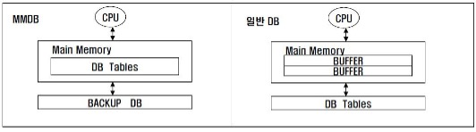
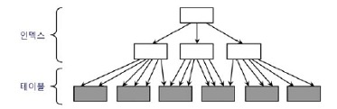
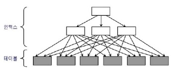

## 3. 인덱스 튜닝
### 3.1 테이블 액세스 최소화 
#### 3.1.1 인덱스 ROWID
- 인덱스를 스캔하는 이유 ? 
  - 검색 조건을 만족하는 데이터를 인덱스에서 빨리 찾고, 테이블 레코드를 찾아가기 위한 주소값.                           	즉, ROWID를 얻기 위함.
- ROWID = 오브젝트 번호 + 데이터파일 번호 + 블록 번호 + 블록 내의 행 번호
- 물리적 요소로 구성돼 있어 물리적 주소라고 설명한다면 틀리다고 말할 순 없지만 논리적 주소에 	더 가깝다고 할 수 있음.
- ROWID는 디스크 상에서 테이블 레코드를 찾아가기 위한 위치 정보를 가짐.
- 포인터 X, 테이블 레코드와 물리적으로 직접 연결된 구조 X

#### 3.1.2 MMDB (메인 메모리 DB)
- MMDB란 데이터베이스 전체를 메모리에 로드해 놓고 메모리를 통해서만 I/O를 수행하는 DB
- MMDB (Main Memory DB) vs 일반 DB (디스크 기반)


- 튜닝이 잘 된 OLTP성 데이터베이스 시스템은 버퍼캐시 히트율이 99%이다. 즉, 디스크를 경유하지 않고 대부분 데이터를 메모리(버퍼)에서 읽는다. 하지만, MMDB만큼 빠르지 않다.
  - MMDB의 인덱스는 메모리상의 주소정보(포인터)를 갖고, 일반 DB의 인덱스는 디스크상의 주소정보를 갖기 때문에 테이블 액세스하는 비용의 차이가 난다. 일반 DB는 테이블 블록이 수시로 변경되고 다른 공간에 캐싱되기 때문에 인덱스에서는 디스크 주소 정보를 이용해 버퍼 블록을 찾는다.

#### 3.1.3 I/O 메커니즘
- 인덱스를 이용하여 테이블 블록을 찾는 과정
  1. 인덱스 스캔 후 리프 블록에서 읽은 ROWID를 분해해서 DBA정보 찾기
  2. 읽고자 하는 DBA(Data Block Address; 디스크 상의 블록 위치 정보)를 해시 함수에 입력해서 해시체인을 찾기
  3. 해시 체인을 통해 버퍼 헤더를 찾기
  4. 버퍼 헤더를 통해 버퍼 블록을 찾기
- 데이터 블록을 읽을 때 디스크로 가기 전에 버퍼캐시부터 찾는다. 버퍼캐시에 없을 경우 디스크에서 버퍼	캐시에 적재한 후에 블록을 읽는다.


### 3.2 인덱스 클러스터링 팩터
#### 3.2.1 클러스터링 팩터(Clustering Factor; CF)란 ?
  - 특정 컬럼을 기준으로 같은 값을 갖는 데이터가 서로 모여있는 정도.
- CF가 좋은 컬럼에 생성한 인덱스는 검색 효율이 매우 좋음
- 테이블 액세스량에 비해 블록 I/O가 적게 발생함.

    <br>

- [그림 2-1] 처럼 CF가 좋은 경우 다음에 읽을 테이블 블록과 직전에 읽은 테이블 블록의 주소가 같으면 	바로 테이블 블록을 읽으므로 블록 I/O 과정 생략
    <br><br>
   

- [그림 2-2] 처럼 CF가 안 좋은 경우 테이블을 액세스하는 횟수만큼 블록 I/O 발생

### 3.3 인덱스 손익분기점
#### 3.3.1 정의
- Index Range Scan에 의한 테이블 액세스가 Table Full Scan 보다 느려지는 지점

#### 3.3.2 인덱스 이용한 테이블 액세스가 Table Full Scan보다 느려지는 요인
	
||Table Full Scan|인덱스 이용한 테이블 액세스|
|--|--|--|
|테이블 액세스 방식|시퀀셜 액세스|랜덤 액세스|
|입출력 방식|Multi Block I/O|Single Block I/O|

- 이런 요인에 의해 인덱스 손익분기점은 보통 5~20%의 낮은 수준에서 결정됨.
- CF에 따라 손익분기점은 크게 달라진다. CF가 나쁘면 5% 미만에서 결정되고 CF가 아주 좋을 때 손익분기점이 90% 수준까지 올라가기도 함.
- 인덱스를 이용한 테이블 액세스가 항상 좋다는 것도 아니고, Table Full Scan이 항상 나쁜 것도 아니다!

#### 3.3.3 온라인 프로그램 튜닝 vs 배치 프로그램 튜닝
- 온라인 프로그램은 소량데이터를 읽고 갱신하므로 인덱스를 효과적으로 활용하는 것이 중요
  - 인덱스를 이용하는 NL조인 방식 사용
- 배치 프로그램은 대량데이터를 읽고 갱신하므로 전체범위 처리 기준으로 튜닝하는 것이 중요
  - Full Scan과 해시 조인이 유리


### 3.4 인덱스 컬럼 추가
### 3.4.1 인덱스 컬럼 추가
- 테이블 액세스 최소화를 위해 가장 일반적으로 사용하는 튜닝 기법
- 실제 운영 환경에서는 인덱스 구성을 변경하기 쉽지 않음.
- 인덱스를 새로 만들면 인덱스 관리 비용 증가, DML부하에 따른 트랜잭션 성능 저하가 발생할 수 있음.
  - 기존 인덱스에 컬럼을 추가함으로써 테이블 랜덤 액세스 횟수를 줄여줌.

### 3.5 인덱스만 읽고 처리
#### 3.5.1 Covered 인덱스
- 테이블 액세스 단계 필터 조건에 의해 버려지는 레코드가 많을 때
  - 인덱스에 컬럼을 추가하여 효율성↑
- 반대로 필터 조건에 의해 버려지는 레코드가 거의 없다면 비효율은 없음.
  - 비효율은 없더라도 결과 데이터가 많다면 그만큼 테이블 랜덤 액세스가 많이 발생하므로 성능이 느릴 수 밖에 없음. 이 경우 쿼리에 사용된 컬럼을 모두 인덱스에 추가해서 테이블 액세스가 아예 발생하지 않도록 함. (Covered 쿼리, Covered 인덱스)
#### 3.5.2 Include 인덱스
- Oracle엔 X, SQL Server 2005 버전에 추가됨.
- 인덱스 키 외에 미리 지정한 컬럼을 리프 블록에 함께 저장하는 기능
```
 create index emp_x01 on emp (deptno) include (sal)
```
```
 create index emp_x01 on emp (deptno, sal)
```
- exp_x01 인덱스는 sal 컬럼을 리프 블록에만 저장
  - 수직적 탐색에는 deptno만 사용하고, 수평적 탐색에는 sal 컬럼을 필터 조건으로 사용 가능
- exp_x02 인덱스는 deptno와 sal 컬럼 모두 루트와 브랜치 블록에 저장
  - 둘 다 수직적 탐색에 사용 가능
- Include 인덱스는 순전히 테이블 랜덤 액세스를 줄이는 용도로 개발

### 3.6 인덱스 구조 테이블
#### 3.6.1 인덱스 구조 테이블(Index-Organized Table; IOT)란 ?
- 테이블 랜덤 액세스가 아예 발생하지 않도록 테이블을 인덱스 구조로 생성
- 일반 인덱스는 테이블을 찾아가기 위한 ROWID를 갖는 구조, IOT는 그 자리에 테이블 데이터를 가짐.
- 즉, 테이블 블록에 있어야 할 데이터를 인덱스 리프 블록에 모두 저장
- 테이블을 인덱스 구조로 만드는 구문
```
create table index_ort_t (a number, b varchar(10),
constraint index_org_t_pk primary key (a) organization index)
```
- 일반 테이블은 힙 구조 테이블( 대개 생략하지만 organization 옵션 명시할 수도 있음)
```
create table heap_ort_t (a number, b varchar(10),
constraint heap_org_t_pk primary key(a) organization heap)
```
- IOT는 인덱스 구조 테이블이므로 정렬 상태를 유지하며 데이터 입력
  - 인위적으로 CF(클러스터링 팩터)를 좋게 만드는 방법 중 하나
- 시퀀셜 방식으로 데이터 액세스 (BETWEEN이나 부등호 조건으로 넓은 범위 읽을 때 유리)

### 3.7 클러스터 테이블
### 3.7.1 인덱스 클러스터 테이블
- 클러스터 키 값이 같은 레코드를 한 블록에 모아서 저장하는 구조
- 한 블록에 모두 담을 수 없을 때는 새로운 블록을 할당해서 클러스터 체인으로 연결
- 다중 테이블 클러스터
  - 여러 테이블 레코드를 같은 블록에 저장
- 인덱스 클러스터 테이블 생성하는 방법
  1. 클러스터 생성
    ```
    create cluster c_dept# (deptno number(2)) index
    ```
  3. 클러스터 인덱스 정의
    ```
    create index c_dept$_idx on cluster c_dept#
    ```
  4. 클러스터 테이블 생성
    ```
    create table dept (
        deptno number(2) not null,
        dname varchar2(14) not null,
        loc varchar2(13))
    cluster c_dept#(deptno);
    ```
### 3.7.2 해시 클러스터 테이블
- 인덱스를 사용하지 않고 해시 알고리즘을 사용해 클러스터를 찾아가는 구조
- 해시 클러스터 테이블 생성하는 방법
  1. 클러스터 생성
    ```
    create cluster c_dept#( deptno number(2) ) hashkeys 4;
    ```
  2. 클러스터 테이블 생성
    ```
    create table dept (
        deptno number(2) not null,
        dname varchar2(14) not null,
        loc varchar2(13) )
    cluster c_dept#(deptno);
    ```
## 3.2 부분범위 처리 활용
- 목적 
  - 테이블 랜덤 액세스로 인한 인덱스 손익분기점의 한계를 극복하기 위한 것 
  - 빠른 응답속도

- 부분범위 처리 
  - DBMS가 클라이언트에게 데이터를 전송할 때 일정량씩 나누어 전송. 
  - 전송 후 데이터가 남아있어도 클라이언트가 추가 Fetch Call 할 때까지 대기 
  - DBMS가 먼저 읽는 데이터부터 Array Size(일정량)을 전송하고 멈춘다. 
  - 데이터 전송 후 서버 프로세스는 CPU를 OS에 반환하고 대기 큐에서 잠을 잔다. 
    - 연속 전송이 아닌 사용자의 Fetch Call이 있을 때마다 일정량씩 나누어 전송하는 것
- ArraySize가 10인 자바 프로그램의 데이터 읽기 메커니즘
  1. 처음에 데이터 10건을 캐시에 저장
  2. rs.next()시 캐시에서 데이터를 읽는다. 
  3. 캐시 데이터 소진시 rs.next() 호출 시 Fetch Call을 발생하여 데이터 10건 전송받는다. 
  4. 2-3번 반복

- 정렬 조건이 있을 때 부분범위 처리 – order by
  - 모든 데이터를 읽어 정렬 후에 데이터 전송 = 전체범위처리 
  - created 컬럼이 선두인 인덱스가 있는 경우 항상 정렬된 상태이므로 결과집합 바로 전송 가능 = 부분범위 처리 
  - Array Size는 클라이언트 프로그램에서 설정가능 . – [3-16그림] 162p 참고
  - 대량 데이터일 경우 Array Size를 조절(늘려)하여 Fetch Call 횟수 감소 
  - 부분처리 원리 활용하는 툴 – 오렌지, 토드
  - 부분범위 처리 구현 - 165p JAVA 코드   //보통은 개발 프레임워크에 미리 구현된 기능을 사용
- OLTP 부분범위 처리에 의한 성능개선 원리 
  - OLTP
    - 온라인 트랜잭션을 처리하는 시스템, 소량의 데이터를 읽고 갱신
  - 167p 인덱스 선두컬럼에 의해 sort 연산 생략
- 앞쪽 일부만 출력 후 멈춘다. 대부분의 툴이 이미 구현되어 있다. 
  - (배치 I/O 
    - 블록 건당 I/O call을 발생시키는 비효율을 줄이기 위한 기능. 테이블 블록 디스크 I/O Call을 미뤘다가 한꺼번에 처리한다. 
    - 실제 배치 I/O 작동 시 데이터 출력 순서가 인덱스 정렬 순서와 다를 수 있다. = sort 생략 불가 
    - order by 절이 없는 경우에는 정렬 순서를 보장할 필요가 없어서 sort 연산을 안함 )  


